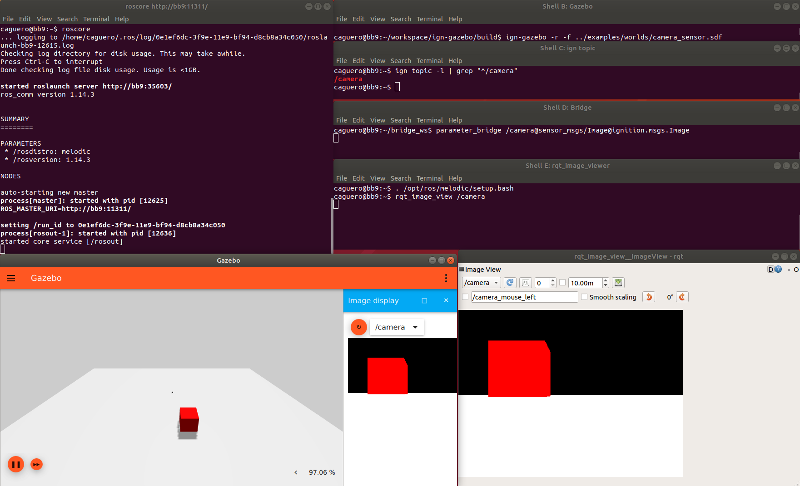

# ROS Integration

Most of the Ignition libraries use [Ignition Transport](https://bitbucket.org/ignitionrobotics/ign-transport)
to exchange data between different software components. This tutorial details
how to interface with [ROS](http://www.ros.org/), enabling the ability to use
tools such as [Rviz](http://wiki.ros.org/rviz) for robot or sensor
visualization.

# ros1_ign_bridge to the rescue

ros1_ign_bridge provides a network bridge which enables the exchange of messages
between ROS 1 and Ignition Transport. Its support is limited to only certain
message types. Please, read this [README](https://github.com/osrf/ros1_ign_bridge)
to verify if your message type is supported by the bridge.

# How to install ros1_ign_bridge

## Binary install

Not available yet.

## Source install

See the [prerequisites](https://github.com/osrf/ros1_ign_bridge#prerequisites)
and [install section](https://github.com/osrf/ros1_ign_bridge#building-the-bridge-from-source)
of the bridge documentation. This tutorial requires Ubuntu Melodic or newer.

Assuming that you have ROS Melodic, you can install all dependencies with:

```
sudo apt install ros-melodic-desktop ros-melodic-rqt-image-view libignition-common3-dev libignition-transport6-dev
```

# Run the bridge and exchange images

In this example, we're going to generate Ignition Transport images using Gazebo, that will be converted into ROS 1 images, and visualized with rqt_viewer.

First we start a ROS 1 `roscore`:

```
# Shell A:
. /opt/ros/melodic/setup.bash
roscore
```

Then we start Gazebo.

```
# Shell B:
ign-gazebo -r -f camera_sensor.sdf
```

Gazebo should be running and publishing images over the `/camera` topic.
Let's verify it:

```
# Shell C:
ign topic -l | grep "^/camera"
/camera
```

Then we start the parameter bridge with the previous topic.

```
# Shell D:
. ~/bridge_ws/install/setup.bash
rosrun ros1_ign_bridge parameter_bridge /camera@sensor_msgs/Image@ignition.msgs.Image
```

Now we start the ROS 1 GUI:

```
# Shell E:
. /opt/ros/melodic/setup.bash
rqt_image_view /camera
```

You should see the current images in `rqt_image_view` which are coming from
Gazebo (published as Ignition Msgs over Ignition Transport).

The screenshot shows all the shell windows and their expected content
(it was taken using ROS Melodic):



