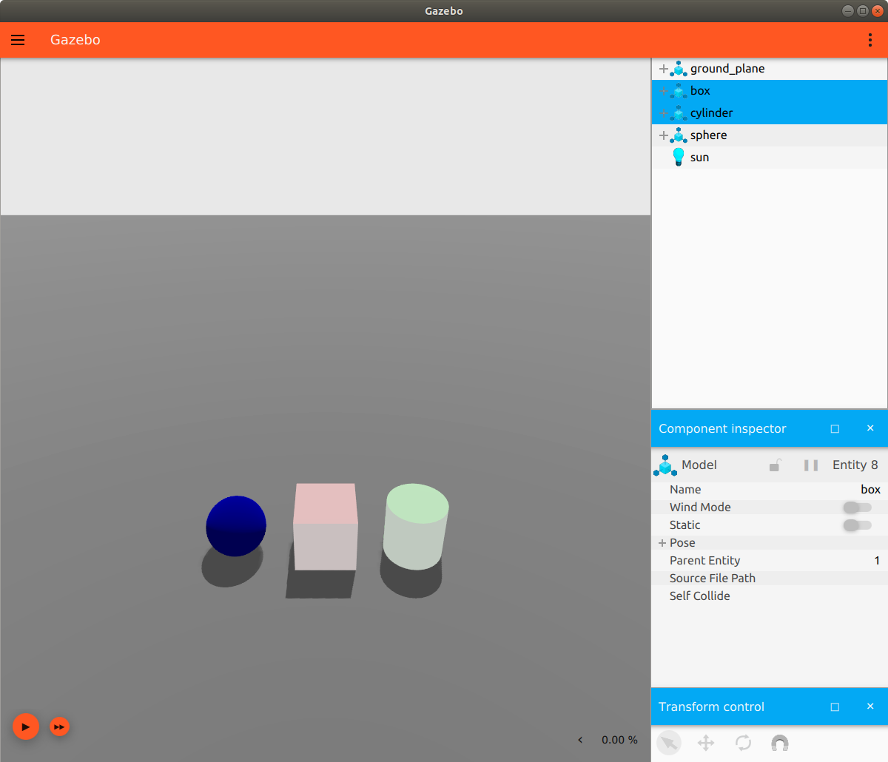
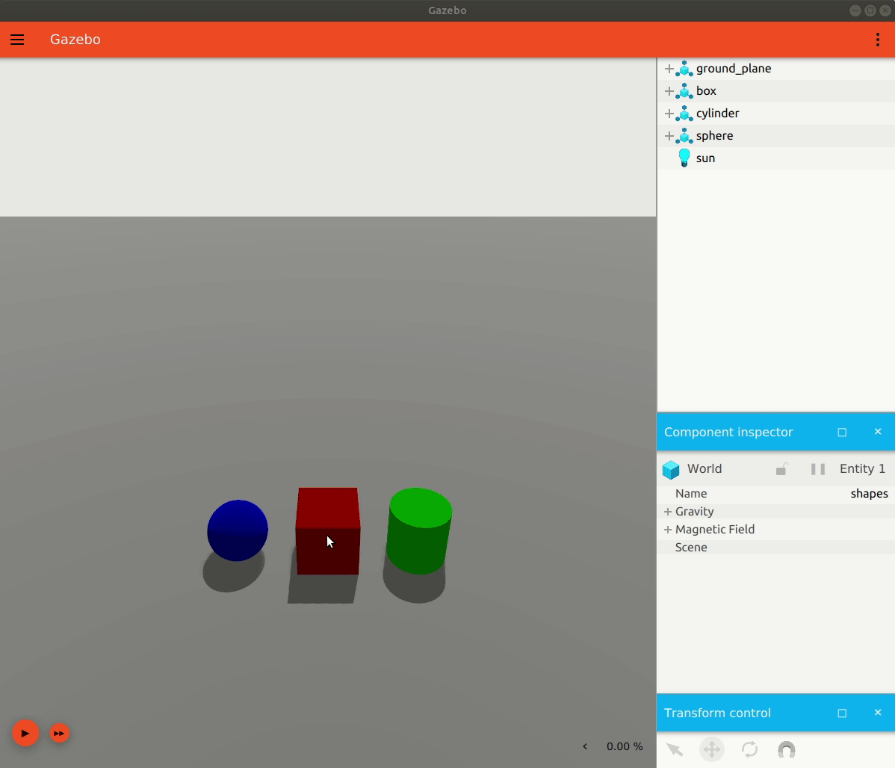
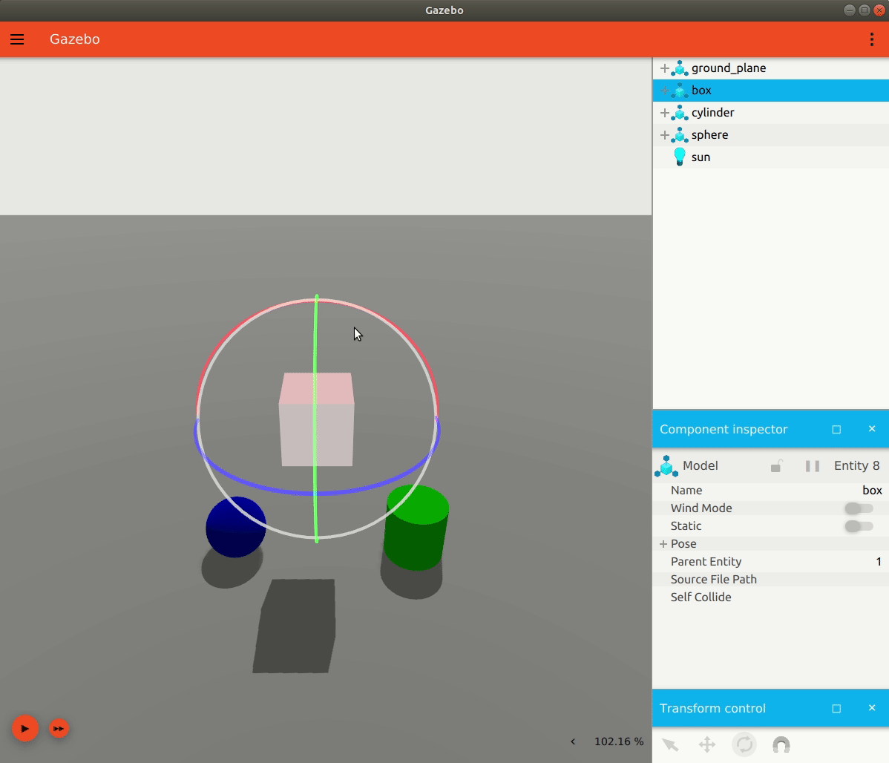
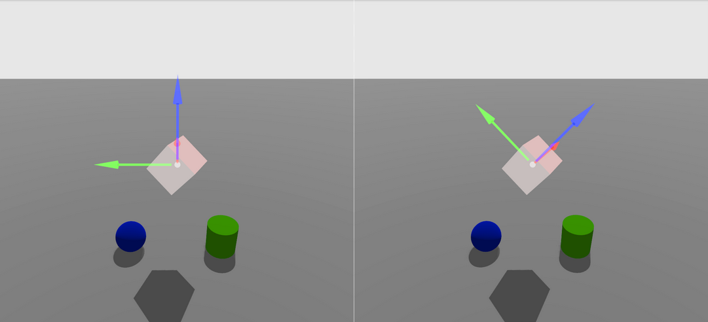
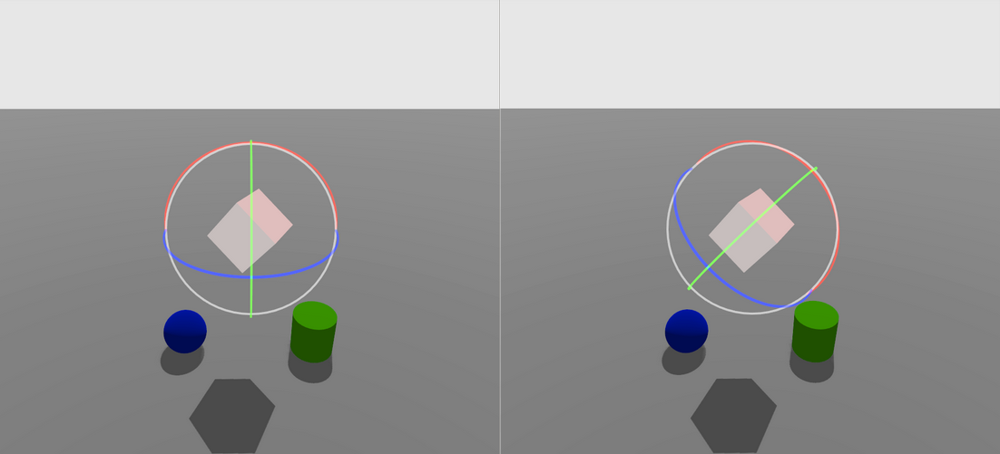

# Manipulating Models

This tutorial will walk you through using two important plugins vital to model and scene manipulation in the Ignition GUI.

The Transform Control plugin is a combination of keybindings and transform control options: selection, translation, rotation and custom snap values.
This chart of [Ignition's keyboard shortcuts](/blueprint/hotkeys) may be helpful for this tutorial.

The View Angle plugin allows you to quickly and easily adjust the direction from which your scene faces an entity in the simulation.

## Prerequisites

Start by getting Ignition up and running with a sample world:

```bash
ign gazebo shapes.sdf
```

[Understanding the GUI](/blueprint/GUI_tutorial) explains the basics of navigating the Ignition GUI.

## Transform Control

The `shapes.sdf` file contains the Transform Control plugin, which is why the plugin is already at the bottom of the screen when you start.
If you wanted to use the plugin in a world where it isn't already included, you would open the plugin drop-down menu and select it from the list:


### Select Mode

Selection is the default mode.
You can click to select entities in the scene.
A selected entity will be highlighted to indicate its selection.
You can select multiple entities by holding `Ctrl` and clicking.



Entities can't be manipulated in select mode.

You can always return to selection mode from any other mode by pressing `Esc`.

### Translate Mode

Enter into translate mode by clicking the second icon from the left in the Transform Control plugin, or by hitting the keyboard short cut: `T`.


Translate mode allows you to translate entities along the x, y and z axes.

Click on any entity while in translate mode to see the arrows representing the axes you can move along.
The red arrow represents the x-axis, green the y-axis, and blue the z-axis.
Click and hold on any of the arrows while moving your mouse to move the entity in that direction.



Holding down any one of the `X`, `Y` or `Z` keys, or a combination of them, while clicking and dragging will constrain the model's movement along those axes, regardless of the direction you move your mouse or the axis arrow you select.

### Rotate Mode

Enter into rotate mode by clicking the third icon from the left in the Transform Control plugin, or by hitting the keyboard short cut: `R`.


Rotate mode allows you to rotate entities around the roll, pitch and yaw axes of rotation.

Click on any entity while in rotate mode to see the circles representing the axes you can rotate along.
The red circle represents roll, green is pitch, and blue is yaw.
Click and hold on any of the circles while moving your mouse to rotate the entity around that axis.



#### Align to World frame

An entity's local axes can become unaligned from the world frame after rotation.
If you would like to translate about the world frame axis, simply hold `Shift`.

This isn't a permanent realignment; you can move the entity while holding `Shift`, but once you let go it will return to it's local translation frame.



The same can be done for an entity's local rotational frame.



### Enter Custom Snap Values

When translating or rotating, you can "snap" an entity's movement to preset increments by holding `Ctrl` and then clicking and dragging.
By default, the snap value is 1 meter for translation and 45° for rotation.


You can customize snap values by clicking on the furthest-right magnet icon in the Transform Control plugin.

Try holding `Shift` and `Ctrl` simultaneously to snap a model along the world frame is if isn't already aligned.

## View Angle

The View Angle plugin does not come pre-loaded with ``shapes.sdf``, so you will have to select it from the plugins button on the toolbar.

You can choose which angle you want to view the scene from, relative to a selected entity or the world frame if no entity is selected.
The home button will return you to the original view pose from when the scene was loaded.

You can also select multiple entities to face simultaneously from each view angle.


## Next Up

So far you've interacted with basic shape models to learn about Ignition's GUI.
It's also possible to insert more detailed models from [Ignition Fuel](app.ignitionrobotics.org) into the GUI.
Check out the [Model Insertion from Fuel](/blueprint/Model_insertion_fuel) tutorial to learn how.
